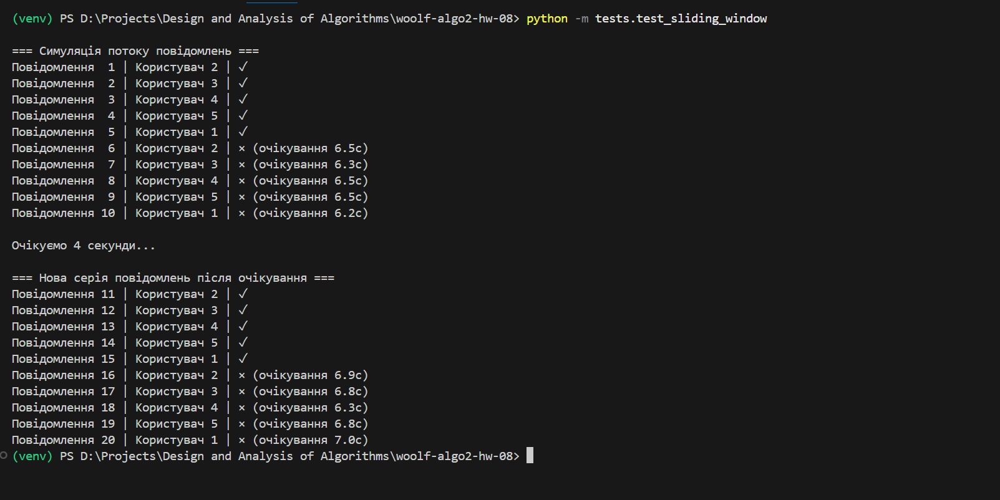
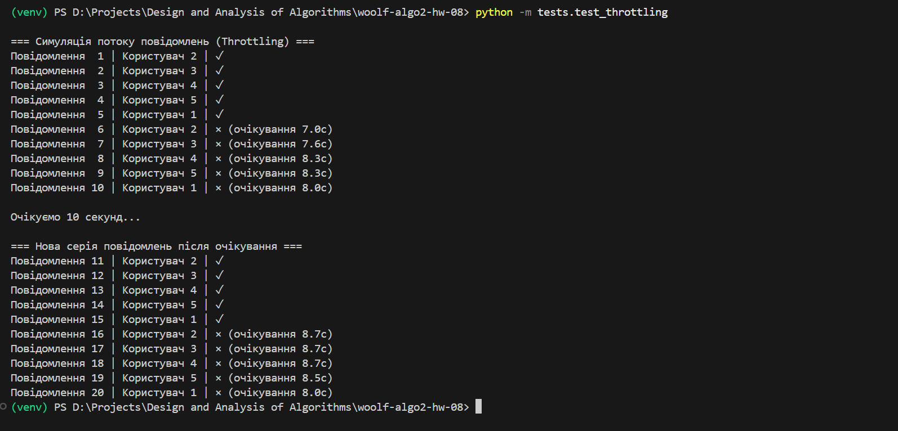

# woolf-algo2-hw-08

# Домашнє завдання 8: Алгоритми контролю потоку та обмеження швидкості

## Мета
Реалізувати два механізми контролю частоти повідомлень для запобігання спаму в чат-системі:
- **Sliding Window** — з точним вікном для перевірки частоти повідомлень.
- **Throttling** — з фіксованим інтервалом між повідомленнями.

## 🔗 Репозиторій
[GitHub — woolf-algo2-hw-08](https://github.com/vikkrat/woolf-algo2-hw-08)

## Структура проєкту

```
woolf-algo2-hw-08/
├── rate_limiters/
│   ├── sliding_window.py
│   ├── throttling.py
├── tests/
│   ├── test_sliding_window.py
│   ├── test_throttling.py
├── screenshots/
│   ├── sliding_window_result.png
│   ├── throttling_result.png
├── requirements.txt
├── .gitignore
├── README.md
```

---

## Завдання

### Sliding Window
- Скрипт: `tests/test_sliding_window.py`
- Клас: `SlidingWindowRateLimiter`
- Результат:
  

### Throttling
- Скрипт: `tests/test_throttling.py`
- Клас: `ThrottlingRateLimiter`
- Результат:
  

---

## Інструкція з запуску

### Клонування репозиторію
`git clone https://github.com/vikkrat/woolf-algo2-hw-08.git`
`cd woolf-algo2-hw-08`

# Створення та активація віртуального середовища
`python -m venv venv`
`source venv/bin/activate`  # або `venv\Scripts\activate` на Windows

### Встановлення залежностей
`pip install -r requirements.txt`

### Запуск обох тестів
`python -m tests.test_sliding_window`
`python -m tests.test_throttling`

---